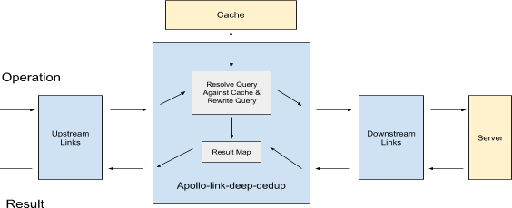

## Goal
The goal of `deepDedupLink` is to resolve GraphQL query against cached data first, sends minimized query to downstream operations (e.g. sending network request to the server), and aggregates result data as final FetchResult.

## Architecture Overview
[`apollo-link`](https://www.apollographql.com/docs/link/) is a standard interface for modifying control flow of GraphQL requests and fetching GraphQL results. It uses [`Observable`](https://github.com/zenparsing/zen-observable#zen-observable) pattern to chain together the client-side query processing operations as Links. `deepDedupLink`, injected as one of the Links:

- receives the query from upstream Links (in a form of `GraphQL AST`)
- deep-clones the query for later restoration after execution
- Initializes a `resultMap` that holds the result data
- Resolves the query against the cache as much as possible, which involves a `Depth First Traversal` of the `GraphQL query AST`, for each  `SelectionSet`:
  - Resolves the `Fields/Selections` (*recursively*, if there’re nested SelectionSets), for each `field`:

    - If the `field` can be fulfilled by cached data, remove the `field` from the `SelectionSet` in the `query AST`, appends the data to the `resultMap`
    - If the `field` is missing in cached data, continues

  - If all `field`s in the `SelectionSet` are fulfilled (with no child `selection` in the sub-AST), removes the `SelectionSet` node from the query AST

  - If there is any data-missing `field` (with child `selection` in the sub-AST), continues

- Restores the query to `initial query`
- If **full cache hit**, sends the `data from cache` directly to and notifies the upstream Links
- Otherwise, sends the modified query to downstream Links and subscribe to the results. Once there’s data back from downstream links
  - If we encounter **full cache miss**, sends the `data from network` directly to and notifies the upstream Links
  - If we have partially resolved the query, aggregate the results by merging `data from cache` and `data from network`, sends final results to and notifies upstream Links

The flow can be represented in the diagram below:

